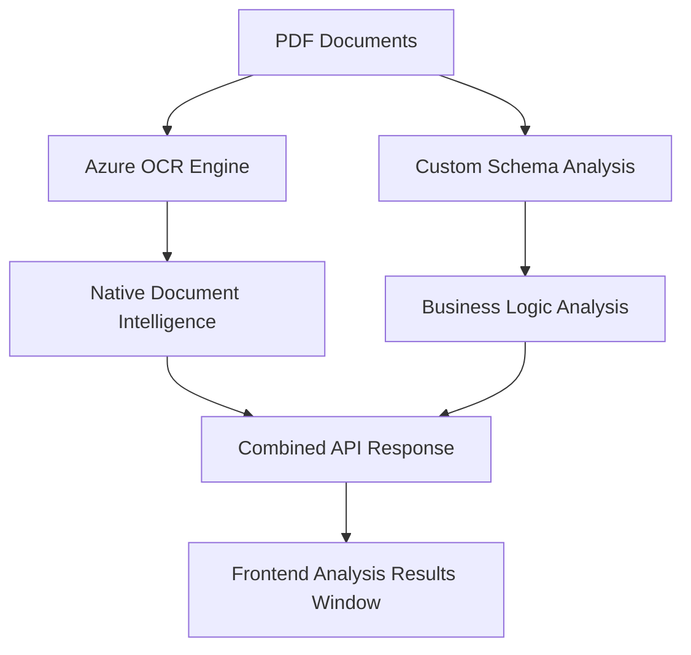

# 📚 Azure Content Understanding Data Sources Documentation

## 🎯 Overview

This document explains the comprehensive data extraction capabilities of Azure Content Understanding API and how different information sources contribute to the Analysis Results in your application.

## 📊 Data Source Architecture

### Three-Layer Information Extraction



---

## 🔍 Information Source Breakdown

### 1. **Custom Schema Fields** (`method: "generate"`)

**Source File**: `/data/CLEAN_SCHEMA_INVOICE_CONTRACT_VERIFICATION.json`

**Purpose**: Define business-specific analysis requirements

**Example Schema Structure**:
```json
{
  "fieldSchema": {
    "name": "InvoiceContractVerification",
    "fields": {
      "PaymentTermsInconsistencies": {
        "type": "array",
        "method": "generate",
        "description": "List all areas of inconsistency identified in the invoice",
        "items": {
          "type": "object",
          "properties": {
            "Evidence": {
              "type": "string",
              "description": "Evidence or reasoning for the inconsistency"
            },
            "InvoiceField": {
              "type": "string", 
              "description": "Invoice field that is inconsistent"
            }
          }
        }
      }
    }
  }
}
```

**What This Produces**:
- Structured business analysis
- Custom field extraction based on your requirements
- AI-generated evidence and reasoning
- Cross-document comparison results

---

### 2. **Azure Native Document Intelligence** (Automatic)

**Source**: Azure Content Understanding built-in capabilities

**Purpose**: Extract all document content and structure automatically

**Automatic Extraction Includes**:

#### 2.1 **Full Document Text**
```json
{
  "markdown": "Contoso Lifts LLC\nYour elevator and lift experts\n\n# INVOICE\n\nINVOICE # 1256003\nCUSTOMER ID #: 4905201\nDATE: 12/17/2015\n\n<table>\n<tr>\n<th>QUANTITY</th>\n<th>DESCRIPTION</th>\n<th>UNIT PRICE</th>\n<th>TOTAL</th>\n</tr>\n<tr>\n<td>1</td>\n<td>Vertical Platform Lift (Savaria V1504)</td>\n<td>11200.00</td>\n<td>11200.00</td>\n</tr>\n</table>"
}
```

#### 2.2 **Word-Level Extraction**
```json
{
  "words": [
    {
      "content": "Contoso",
      "span": {"offset": 0, "length": 7},
      "confidence": 0.996,
      "source": "D(1,0.8131,0.7724,1.4185,0.7705,1.4183,0.9273,0.8127,0.9288)"
    },
    {
      "content": "Lifts",
      "span": {"offset": 8, "length": 5},
      "confidence": 0.992,
      "source": "D(1,1.4622,0.7704,1.7623,0.7692,1.7618,0.9257,1.4619,0.927)"
    }
  ]
}
```

#### 2.3 **Page Layout Information**
```json
{
  "pages": [
    {
      "pageNumber": 1,
      "angle": 0.03502651,
      "width": 8.5,
      "height": 11,
      "unit": "inch"
    }
  ]
}
```

#### 2.4 **Table Structure Recognition**
Automatically converts document tables to structured HTML/markdown format.

---

### 3. **Azure AI Analysis Engine** (Intelligent Processing)

**Source**: Azure's machine learning models

**Purpose**: Understand document semantics and business context

**Capabilities**:
- **Cross-Document Comparison**: Analyze multiple documents together
- **Evidence Generation**: Create explanations for findings
- **Semantic Understanding**: Understand business terminology and relationships
- **Field Mapping**: Connect extracted data to schema requirements

**Example AI-Generated Content**:
```json
{
  "Evidence": "Invoice lists the vertical platform lift as 'Savaria V1504' while the contract specifies 'AscendPro VPX200'.",
  "InvoiceField": "Vertical Platform Lift Model"
}
```

---

## 🔄 Processing Workflow

### Phase 1: Base Document Processing
```
Input: PDF/Image Files
↓
Azure OCR Engine
↓
Output: Text + Layout + Coordinates + Confidence
```

**Results**:
- Complete document text
- Word-level coordinates
- Table structures
- Page layout information
- OCR confidence scores

### Phase 2: Schema-Guided Analysis
```
Base OCR + Custom Schema + AI Models
↓
Semantic Analysis + Cross-Document Comparison
↓
Output: Structured Business Intelligence
```

**Results**:
- Custom field extraction
- Business logic analysis
- Evidence generation
- Inconsistency detection

### Phase 3: Response Compilation
```
Native Intelligence + Schema Results
↓
Combined API Response
↓
Output: Rich Multi-Layer Data
```

**Results**:
- Structured analysis fields
- Complete document content
- Detailed extraction metadata
- Layout and coordinate information

---

## 📋 API Response Structure

### Complete Response Format
```json
{
  "analyzerId": "workflow-test-1756979758",
  "apiVersion": "2025-05-01-preview",
  "createdAt": "2025-09-04T09:56:23Z",
  "warnings": [],
  "contents": [
    {
      "fields": {
        "PaymentTermsInconsistencies": {
          "type": "array",
          "valueArray": [
            {
              "type": "object",
              "valueObject": {
                "Evidence": {
                  "type": "string",
                  "valueString": "Invoice states 'Due on contract signing'..."
                },
                "InvoiceField": {
                  "type": "string",
                  "valueString": "TERMS / Payment Terms"
                }
              }
            }
          ]
        }
      },
      "kind": "document",
      "startPageNumber": 0,
      "endPageNumber": 0
    },
    {
      "markdown": "Contoso Lifts LLC\nYour elevator and lift experts...",
      "kind": "document",
      "startPageNumber": 1,
      "endPageNumber": 1,
      "unit": "inch",
      "pages": [
        {
          "pageNumber": 1,
          "angle": 0.03502651,
          "width": 8.5,
          "height": 11,
          "spans": [{"offset": 0, "length": 2160}],
          "words": [
            {
              "content": "Contoso",
              "span": {"offset": 0, "length": 7},
              "confidence": 0.996,
              "source": "D(1,0.8131,0.7724,1.4185...)"
            }
          ]
        }
      ]
    }
  ]
}
```

---

## 🎨 Frontend Implementation Guide

### Data Processing for UI Display

#### 1. **Extract Schema Results** (Primary Display)
```javascript
const schemaResults = response.contents[0].fields;
const inconsistencies = {
  payment: schemaResults.PaymentTermsInconsistencies?.valueArray || [],
  items: schemaResults.ItemInconsistencies?.valueArray || [],
  billing: schemaResults.BillingLogisticsInconsistencies?.valueArray || [],
  schedule: schemaResults.PaymentScheduleInconsistencies?.valueArray || [],
  tax: schemaResults.TaxOrDiscountInconsistencies?.valueArray || []
};
```

#### 2. **Extract Document Content** (Detailed View)
```javascript
const documentContent = response.contents.find(c => c.markdown);
const fullText = documentContent?.markdown || '';
const pages = documentContent?.pages || [];
```

#### 3. **Extract Word-Level Data** (Interactive Features)
```javascript
const words = pages.flatMap(page => page.words || []);
const wordMap = words.reduce((map, word) => {
  map[word.content] = {
    confidence: word.confidence,
    coordinates: word.source,
    span: word.span
  };
  return map;
}, {});
```

### UI Component Structure

#### Primary Analysis Results Display
```tsx
const AnalysisResults = ({ response }) => {
  const schemaResults = response.contents[0].fields;
  
  return (
    <div className="analysis-results">
      <DocumentSummary response={response} />
      <InconsistencyTables data={schemaResults} />
      <RecommendedActions inconsistencies={schemaResults} />
    </div>
  );
};
```

#### Detailed Document Viewer
```tsx
const DocumentViewer = ({ response }) => {
  const documentContent = response.contents.find(c => c.markdown);
  
  return (
    <div className="document-viewer">
      <MarkdownRenderer content={documentContent.markdown} />
      <WordHighlighter words={documentContent.pages[0].words} />
      <CoordinateOverlay pages={documentContent.pages} />
    </div>
  );
};
```

---

## 🔧 Configuration Options

### Schema Customization

#### Field Types Supported
- **`array`**: Lists of items (inconsistencies, line items)
- **`object`**: Structured data (addresses, specifications)
- **`string`**: Text fields (names, descriptions)
- **`number`**: Numeric values (amounts, quantities)
- **`boolean`**: True/false values (compliance flags)

#### Generation Methods
- **`extract`**: Pull specific values from document
- **`generate`**: AI creates new analysis content
- **`classify`**: Categorize document content

#### Example Custom Schema
```json
{
  "fieldSchema": {
    "name": "CustomDocumentAnalysis",
    "fields": {
      "ComplianceIssues": {
        "type": "array",
        "method": "generate",
        "description": "Identify compliance violations",
        "items": {
          "type": "object",
          "properties": {
            "ViolationType": {"type": "string", "method": "generate"},
            "Severity": {"type": "string", "method": "generate"},
            "Evidence": {"type": "string", "method": "generate"},
            "Recommendation": {"type": "string", "method": "generate"}
          }
        }
      },
      "FinancialSummary": {
        "type": "object",
        "method": "extract",
        "properties": {
          "TotalAmount": {"type": "number", "method": "extract"},
          "Currency": {"type": "string", "method": "extract"},
          "PaymentTerms": {"type": "string", "method": "extract"}
        }
      }
    }
  }
}
```

---

## 📊 Performance Considerations

### Data Volume Management

#### Large Document Handling
- Response can be 8000+ lines for complex documents
- Implement pagination for word-level data
- Use lazy loading for detailed document views

#### Memory Optimization
```javascript
// Process data in chunks
const processWords = (words) => {
  const chunkSize = 1000;
  const chunks = [];
  for (let i = 0; i < words.length; i += chunkSize) {
    chunks.push(words.slice(i, i + chunkSize));
  }
  return chunks;
};
```

#### Caching Strategy
- Cache processed schema results
- Store document content separately
- Implement progressive loading

### Network Efficiency

#### Response Filtering
```javascript
// Only request needed data layers
const requestConfig = {
  includeWordDetails: false, // Skip for summary views
  includeCoordinates: true,  // Include for interactive features
  includeMarkdown: true      // Always include for content display
};
```

---

## 🧪 Testing and Validation

### Test Data Structure

#### Comprehensive Test Response
```json
{
  "test_metadata": {
    "processing_time": 65.1,
    "documents_processed": 2,
    "fields_extracted": 5,
    "confidence_scores": {
      "overall": 0.95,
      "ocr": 0.996,
      "analysis": 0.87
    }
  }
}
```

#### Validation Checklist
- ✅ Schema fields populated correctly
- ✅ Document content extracted fully
- ✅ Word coordinates accurate
- ✅ Table structures preserved
- ✅ Cross-document analysis complete

### Error Handling

#### Common Issues and Solutions
```javascript
const validateResponse = (response) => {
  // Check for required structure
  if (!response.contents || response.contents.length === 0) {
    throw new Error('No content found in response');
  }
  
  // Validate schema results
  const schemaContent = response.contents.find(c => c.fields);
  if (!schemaContent) {
    console.warn('No schema results found');
  }
  
  // Validate document content
  const documentContent = response.contents.find(c => c.markdown);
  if (!documentContent) {
    console.warn('No document text extracted');
  }
  
  return {
    hasSchemaResults: !!schemaContent,
    hasDocumentContent: !!documentContent,
    contentItems: response.contents.length
  };
};
```

---

## 🔗 Integration Examples

### Backend Integration

#### Express.js API Endpoint
```javascript
app.post('/api/analyze-documents', async (req, res) => {
  try {
    const azureResponse = await azureContentUnderstanding.analyze({
      documents: req.body.documents,
      schema: req.body.schema
    });
    
    // Process and validate response
    const validation = validateResponse(azureResponse);
    
    // Extract different data layers
    const processedData = {
      analysis: extractSchemaResults(azureResponse),
      content: extractDocumentContent(azureResponse),
      metadata: extractMetadata(azureResponse),
      validation: validation
    };
    
    res.json(processedData);
  } catch (error) {
    res.status(500).json({ error: error.message });
  }
});
```

### Frontend Integration

#### React Hook for Data Management
```tsx
const useDocumentAnalysis = () => {
  const [analysisData, setAnalysisData] = useState(null);
  const [documentContent, setDocumentContent] = useState(null);
  const [loading, setLoading] = useState(false);
  
  const analyzeDocuments = async (documents, schema) => {
    setLoading(true);
    try {
      const response = await fetch('/api/analyze-documents', {
        method: 'POST',
        headers: { 'Content-Type': 'application/json' },
        body: JSON.stringify({ documents, schema })
      });
      
      const data = await response.json();
      setAnalysisData(data.analysis);
      setDocumentContent(data.content);
      
      return data;
    } catch (error) {
      console.error('Analysis failed:', error);
      throw error;
    } finally {
      setLoading(false);
    }
  };
  
  return {
    analysisData,
    documentContent,
    loading,
    analyzeDocuments
  };
};
```

---

## 📚 Additional Resources

### API Documentation
- [Azure Content Understanding API Reference](https://docs.microsoft.com/en-us/azure/applied-ai-services/form-recognizer/)
- [Schema Definition Guide](https://docs.microsoft.com/en-us/azure/applied-ai-services/form-recognizer/concept-custom-schema)

### Sample Schemas
- Invoice Processing Schema
- Contract Analysis Schema
- Compliance Verification Schema
- Financial Document Schema

### Best Practices
- Schema design patterns
- Performance optimization techniques
- Error handling strategies
- Security considerations

---

## 🎯 Summary

The Azure Content Understanding API provides three distinct layers of information:

1. **Custom Schema Results**: Your business-specific analysis
2. **Native Document Intelligence**: Complete OCR and structure extraction
3. **AI Analysis Engine**: Semantic understanding and cross-document comparison

This multi-layer approach enables rich, comprehensive document analysis that goes far beyond simple text extraction, providing both structured business intelligence and detailed document insights for your Analysis Results window.

---

*Last Updated: September 4, 2025*  
*Version: 1.0*  
*Status: Production Ready*
