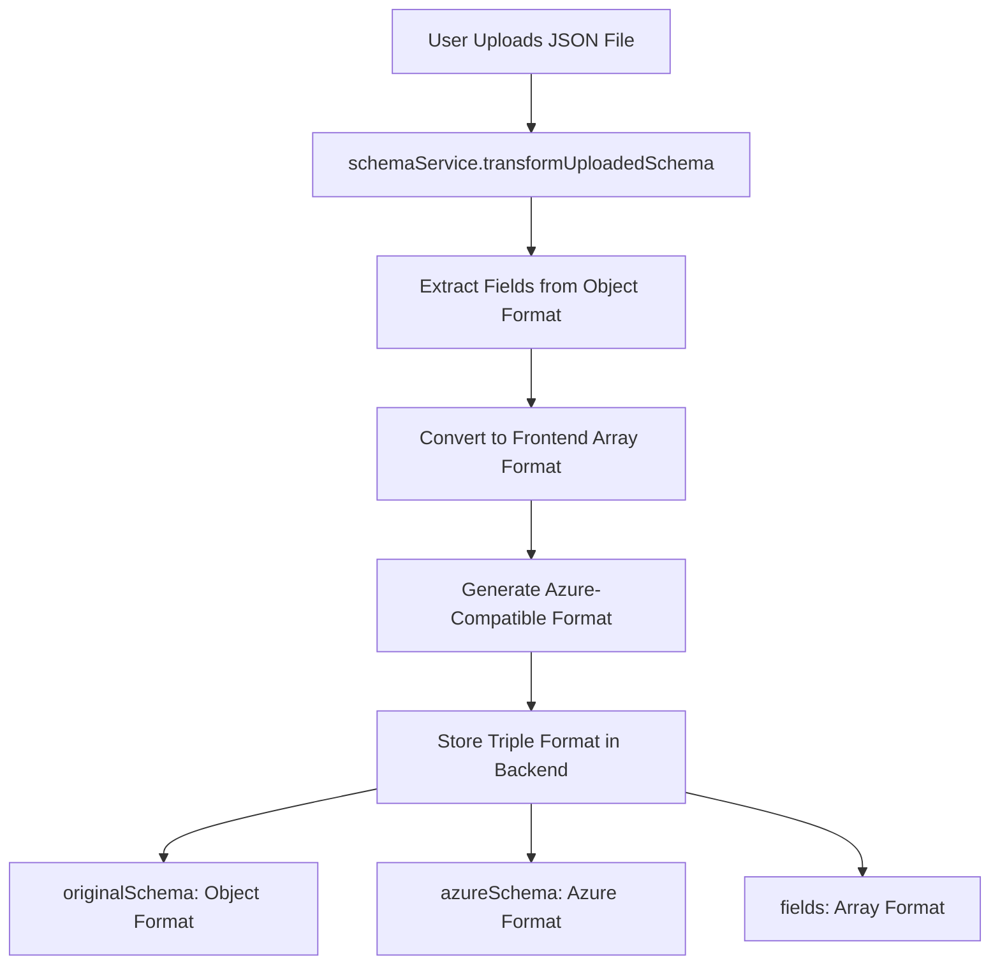
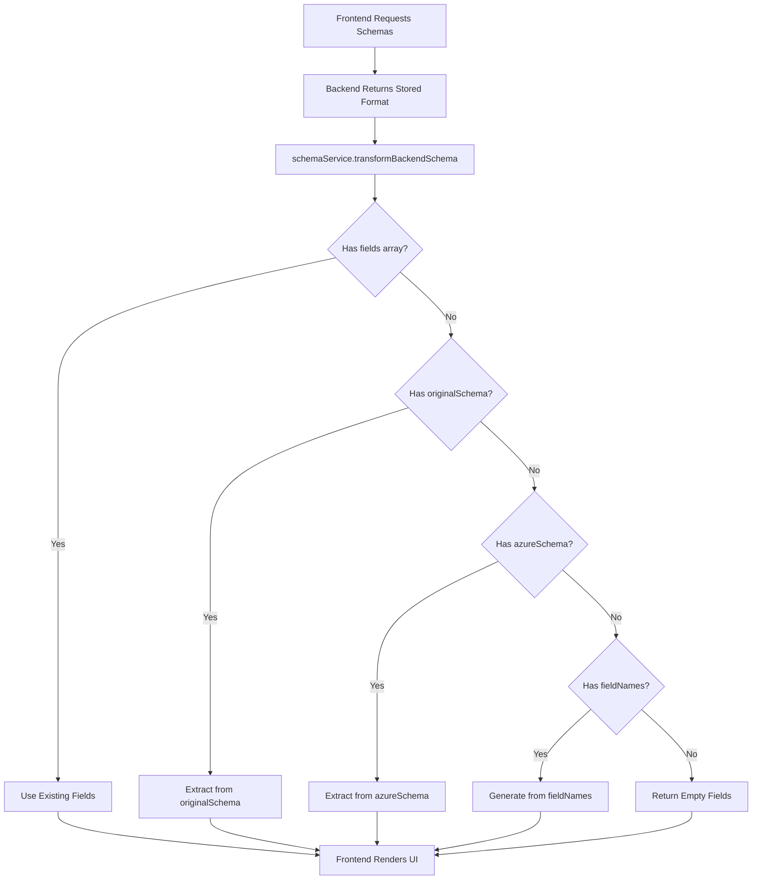
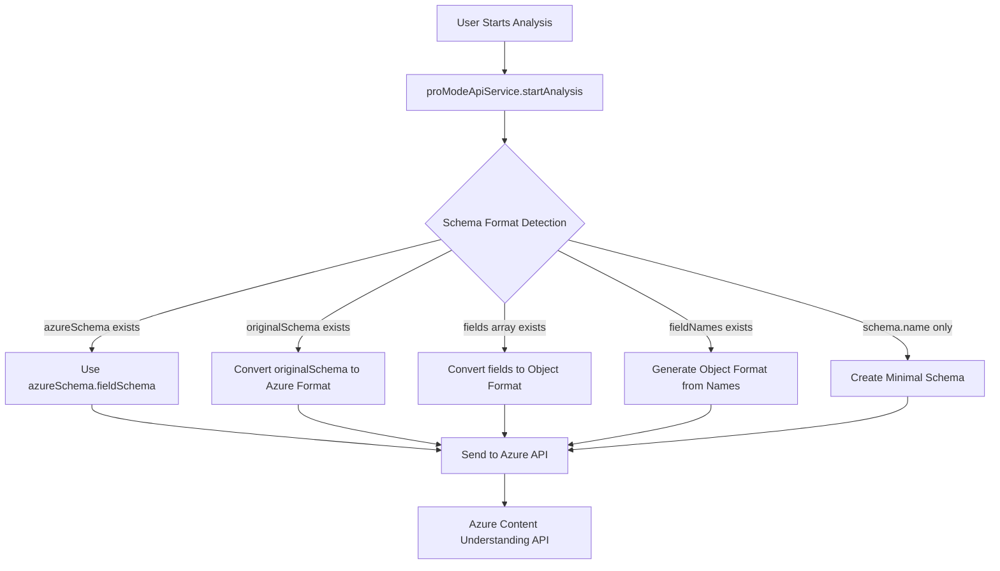

# Schema Format Flow Documentation

## 🔄 **Complete Schema Format Journey**

This document maps the complete journey of schema data through different formats as it flows through the system components.

---

## 📊 **Format Types Overview**

### **1. Upload Format (JSON File)**
```json
{
  "name": "Invoice Processing Schema",
  "description": "Extract invoice data",
  "fieldSchema": {
    "fields": {
      "InvoiceNumber": {
        "type": "string",
        "description": "Invoice number",
        "method": "extract"
      },
      "LineItems": {
        "type": "array",
        "description": "Invoice line items",
        "items": {
          "type": "object",
          "properties": {
            "Description": { "type": "string", "method": "extract" },
            "Amount": { "type": "number", "method": "extract" }
          }
        }
      }
    }
  }
}
```

### **2. Frontend Display Format (Array-based)**
```typescript
{
  id: "schema-123",
  name: "Invoice Processing Schema",
  displayName: "Invoice Processing Schema",
  description: "Extract invoice data",
  fields: [
    {
      id: "field-1",
      name: "InvoiceNumber",
      type: "string",
      valueType: "string", 
      isRequired: false,
      description: "Invoice number",
      generationMethod: "extract"
    },
    {
      id: "field-2", 
      name: "LineItems",
      type: "array",
      valueType: "array",
      isRequired: false,
      description: "Invoice line items",
      generationMethod: "extract"
    },
    {
      id: "field-3",
      name: "LineItems.Description", // Flattened nested field
      type: "string",
      valueType: "string",
      isRequired: false,
      description: "Nested field: LineItems.Description",
      generationMethod: "extract"
    }
  ]
}
```

### **3. Backend Storage Format (Dual Storage)**
```typescript
{
  id: "schema-123",
  name: "Invoice Processing Schema",
  displayName: "Invoice Processing Schema", 
  description: "Extract invoice data",
  kind: "structured",
  
  // Frontend-optimized format
  fields: [
    { id: "field-1", name: "InvoiceNumber", type: "string", ... },
    { id: "field-2", name: "LineItems", type: "array", ... }
  ],
  
  // Original uploaded format (preserved)
  originalSchema: {
    name: "Invoice Processing Schema",
    fieldSchema: {
      fields: {
        "InvoiceNumber": { type: "string", method: "extract" },
        "LineItems": { type: "array", items: {...} }
      }
    }
  },
  
  // Azure API-compatible format
  azureSchema: {
    name: "Invoice Processing Schema", 
    fieldSchema: {
      fields: {
        "InvoiceNumber": { type: "string", method: "extract" },
        "LineItems": { type: "object", method: "generate", properties: {...} }
      }
    }
  },
  
  // Minimal format (production fallback)
  fieldNames: ["InvoiceNumber", "LineItems"]
}
```

### **4. Azure API Format (Analysis Payload)**
```typescript
{
  analysisMode: "pro",
  baseAnalyzerId: "prebuilt-documentAnalyzer",
  schemaId: "schema-123",
  fieldSchema: {
    name: "Invoice Processing Schema",
    description: "Extract invoice data",
    fields: {
      "InvoiceNumber": {
        type: "string",
        description: "Invoice number", 
        method: "extract"
      },
      "LineItems": {
        type: "object",  // ⚠️ Converted from array to object
        description: "Invoice line items",
        method: "generate",
        properties: {
          "Description": { type: "string", method: "extract" },
          "Amount": { type: "number", method: "extract" }
        }
      }
    }
  }
}
```

---

## 🌊 **Data Flow Journey**

### **📤 UPLOAD FLOW**



#### **Step-by-Step Upload Conversion:**

**1. File Upload → Parse JSON**
```typescript
// Raw uploaded file content
const uploadedContent = {
  fieldSchema: {
    fields: {
      "Amount": { type: "number", method: "extract" }
    }
  }
}
```

**2. Transform to Frontend Format**
```typescript
// schemaService.transformUploadedSchema()
const frontendFields = [];
Object.entries(uploadedSchema.fieldSchema.fields).forEach(([fieldName, fieldDef]) => {
  frontendFields.push({
    id: `field-${Date.now()}-${Math.random()}`,
    name: fieldName,
    type: mapFieldType(fieldDef.type),
    description: fieldDef.description,
    generationMethod: fieldDef.method
  });
});
```

**3. Generate Azure Format**
```typescript
// schemaService.convertToAzureFormat()
const azureSchema = {
  ...uploadedSchema,
  fieldSchema: {
    ...uploadedSchema.fieldSchema,
    fields: convertFieldsToObjectFormat(uploadedSchema.fieldSchema.fields)
  }
};
```

**4. Store Triple Format**
```typescript
const storedSchema = {
  fields: frontendFields,           // Array format for UI
  originalSchema: uploadedSchema,   // Original object format
  azureSchema: azureSchema         // Azure-compatible format
};
```

### **📥 RETRIEVAL FLOW**



#### **Step-by-Step Retrieval Conversion:**

**1. Backend Response Processing**
```typescript
// Multiple possible backend response formats
const backendResponse = {
  // Option 1: Complete format
  fields: [{ name: "Amount", type: "number" }],
  
  // Option 2: Nested format
  originalSchema: { fieldSchema: { fields: {...} } },
  
  // Option 3: Minimal format (production)
  fieldNames: ["Amount", "Date", "Vendor"]
};
```

**2. Format Detection & Conversion**
```typescript
// schemaService.transformBackendSchema()
if (backendSchema.fields && Array.isArray(backendSchema.fields)) {
  return backendSchema; // Already in frontend format
}

if (backendSchema.originalSchema?.fieldSchema?.fields) {
  // Convert object format to array format
  const fields = extractFieldsFromFieldSchema(backendSchema.originalSchema.fieldSchema.fields);
  return { ...backendSchema, fields };
}

if (backendSchema.fieldNames && Array.isArray(backendSchema.fieldNames)) {
  // Generate basic fields from names
  const fields = backendSchema.fieldNames.map(name => ({
    id: `field-${Date.now()}`,
    name: name,
    type: 'string',
    generationMethod: 'generate'
  }));
  return { ...backendSchema, fields };
}
```

### **🚀 ANALYSIS FLOW**



#### **Step-by-Step Analysis Conversion:**

**1. Schema Format Detection**
```typescript
// proModeApiService.startAnalysis() - Enhanced format detection
let fieldSchema;

if (selectedSchema?.azureSchema?.fieldSchema) {
  // Best case: pre-converted Azure format
  fieldSchema = selectedSchema.azureSchema.fieldSchema;
  
} else if (selectedSchema?.originalSchema?.fieldSchema) {
  // Convert original upload format to Azure format
  fieldSchema = {
    ...selectedSchema.originalSchema.fieldSchema,
    fields: convertFieldsToObjectFormat(selectedSchema.originalSchema.fieldSchema.fields)
  };
  
} else if (selectedSchema?.fields && Array.isArray(selectedSchema.fields)) {
  // Convert frontend array format to Azure object format
  fieldSchema = {
    name: selectedSchema.name,
    fields: constructSchemaFields(selectedSchema.fields)
  };
  
} else if (selectedSchema?.fieldNames && Array.isArray(selectedSchema.fieldNames)) {
  // Generate from field names (production fallback)
  const fieldsFromNames = {};
  selectedSchema.fieldNames.forEach(fieldName => {
    fieldsFromNames[fieldName] = {
      type: 'object',
      description: `Field: ${fieldName}`,
      method: 'generate'
    };
  });
  fieldSchema = { fields: fieldsFromNames };
}
```

**2. Array-to-Object Conversion**
```typescript
// constructSchemaFields() - Frontend array to Azure object
const constructSchemaFields = (frontendFields) => {
  const fields = {};
  
  frontendFields.forEach(field => {
    if (field.type === 'array') {
      // Convert array fields to object format for Azure API
      fields[field.name] = {
        type: 'object',
        description: field.description,
        method: field.generationMethod || 'generate'
      };
    } else {
      fields[field.name] = {
        type: field.type,
        description: field.description,
        method: field.generationMethod || 'generate'
      };
    }
  });
  
  return fields;
};
```

---

## 🔄 **Format Conversion Functions**

### **1. Upload Transformations**

#### **Object → Array (UI Display)**
```typescript
// schemaService.extractFieldsFromFieldSchema()
extractFieldsFromFieldSchema(fieldsObject: any): ProModeSchemaField[] {
  const fields: ProModeSchemaField[] = [];
  
  Object.entries(fieldsObject).forEach(([fieldName, fieldDef]) => {
    // Create main field
    fields.push({
      id: `field-${Date.now()}-${Math.random()}`,
      name: fieldName,
      type: mapFieldType(fieldDef.type),
      description: fieldDef.description,
      generationMethod: fieldDef.method
    });
    
    // Handle nested properties (flatten for UI)
    if (fieldDef.properties) {
      Object.entries(fieldDef.properties).forEach(([nestedName, nestedDef]) => {
        fields.push({
          id: `field-${Date.now()}-${Math.random()}`,
          name: `${fieldName}.${nestedName}`,
          type: mapFieldType(nestedDef.type),
          description: `Nested field: ${fieldName}.${nestedName}`,
          generationMethod: nestedDef.method
        });
      });
    }
  });
  
  return fields;
}
```

#### **Array → Object (Azure API)**
```typescript
// schemaService.convertFieldsToObjectFormat()
convertFieldsToObjectFormat(fields: any): any {
  const convertedFields = {};
  
  Object.entries(fields).forEach(([fieldName, fieldDef]) => {
    if (fieldDef.type === 'array' && fieldDef.items?.properties) {
      // Convert array to object format for Azure API
      convertedFields[fieldName] = {
        type: 'object',  // ⚠️ Key conversion
        method: fieldDef.method || 'generate',
        properties: fieldDef.items.properties
      };
    } else {
      convertedFields[fieldName] = fieldDef;
    }
  });
  
  return convertedFields;
}
```

### **2. Retrieval Transformations**

#### **fieldNames → Array (Production Fallback)**
```typescript
// schemaService.transformBackendSchema()
if (backendSchema.fieldNames && Array.isArray(backendSchema.fieldNames)) {
  const fields = backendSchema.fieldNames.map((fieldName, index) => ({
    id: `field-${Date.now()}-${index}`,
    name: fieldName,
    type: 'string',
    valueType: 'string',
    isRequired: false,
    description: `Field: ${fieldName}`,
    generationMethod: 'generate'
  }));
  
  return { ...backendSchema, fields };
}
```

### **3. Analysis Transformations**

#### **Frontend Array → Azure Object**
```typescript
// proModeApiService.constructSchemaFields()
const constructSchemaFields = (frontendFields) => {
  const fields = {};
  
  frontendFields.forEach(field => {
    // Skip nested fields (containing dots)
    if (field.name.includes('.')) return;
    
    if (field.type === 'array') {
      // Convert array to object for Azure API compatibility
      fields[field.name] = {
        type: 'object',
        description: field.description,
        method: field.generationMethod || 'generate'
      };
    } else {
      fields[field.name] = {
        type: field.type,
        description: field.description,
        method: field.generationMethod || 'generate'
      };
    }
  });
  
  return fields;
};
```

---

## 🎯 **Format Strategy Summary**

### **Why Multiple Formats?**

| Format | Purpose | Optimized For |
|--------|---------|---------------|
| **Upload Object** | Preserve user's original schema structure | File compatibility, nested structures |
| **Frontend Array** | UI rendering and editing | React components, form validation, field management |
| **Backend Storage** | Flexibility and compatibility | Multiple environment support, fallback strategies |
| **Azure Object** | API compliance | Azure Content Understanding API requirements |

### **Key Conversion Rules**

1. **Array → Object**: Required for Azure API (`array` becomes `object` with `properties`)
2. **Object → Array**: Required for UI (flatten nested fields with dot notation)
3. **fieldNames → Array**: Production fallback (generate basic field objects)
4. **Type Mapping**: Consistent type translation across formats

### **Performance Considerations**

- ✅ **Upload**: One-time conversion cost, stored for reuse
- ✅ **Retrieval**: Lightweight transformation, cached results
- ✅ **Analysis**: Pre-computed Azure format when available
- ✅ **Fallbacks**: Multiple strategies prevent failures

### **Error Resilience**

The format flow includes multiple fallback strategies:

1. **Primary**: Use pre-stored Azure format
2. **Secondary**: Convert from original format
3. **Tertiary**: Build from frontend fields
4. **Quaternary**: Generate from fieldNames
5. **Fallback**: Create minimal schema

This ensures the system works regardless of:
- Backend storage changes
- Environment differences (dev vs prod)
- Legacy schema formats
- Partial data availability

---

## 🚀 **Future Optimization Opportunities**

### **Potential Improvements**

1. **Format Caching**: Cache converted formats to reduce computation
2. **Lazy Conversion**: Convert formats only when needed
3. **Format Validation**: Validate format consistency across transformations
4. **Performance Monitoring**: Track conversion performance and bottlenecks

### **Schema Evolution Support**

The current format flow supports:
- ✅ **Backward Compatibility**: Legacy schemas continue working
- ✅ **Format Migration**: Gradual migration to new formats
- ✅ **API Changes**: Adaptation to Azure API updates
- ✅ **Environment Flexibility**: Different backend implementations

This architecture provides a robust foundation for schema management that can adapt to changing requirements while maintaining system stability.
